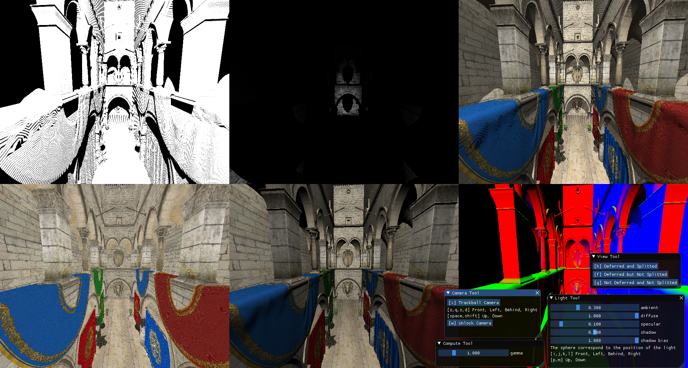

# OpenGL Framework by BELOS Thomas




## Required packages

OpenGL, SDL2, GLEW, GLM, and ASSIMP are required.

You can install these packages on Ubuntu by using : 

```
sudo apt install libsdl2-dev libglew-dev libglm-dev libassimp-dev
```

## Compilation and installation

```
mkdir build
cmake ..
make
```

## Run the examples

From the build directory, run on of the generated binaries
```
./solarsystem
```

## References

### Planet Pixel Emporium

http://planetpixelemporium.com/

### NASA

https://nssdc.gsfc.nasa.gov/planetary/planetfact.html

### STB Image

https://github.com/nothings/stb
